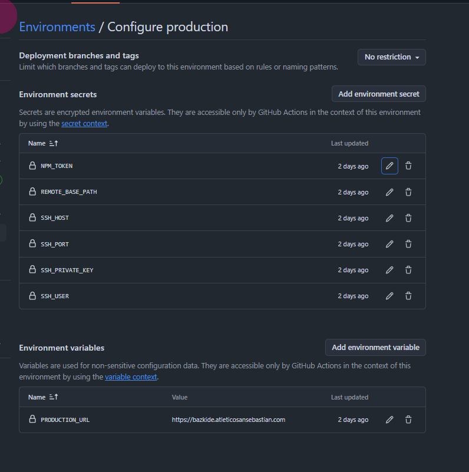

# Guia didactica: GitHub Actions para deploy Vite + PHP por SSH

Este README es material formativo para explicar en clase como montar un deploy con GitHub Actions en proyectos Vite con backend PHP y dependencias Composer. La skill operativa para Codex es `SKILL.md`; este documento esta pensado para personas.

## 1. Objetivo De La Clase

Al terminar, el alumnado deberia entender y poder reproducir:

- Que es un workflow de GitHub Actions.
- Que ocurre cuando hacemos `push` a `main`.
- Como se construye el frontend con Node/Vite.
- Como se instalan dependencias PHP con Composer.
- Como se suben archivos al hosting por SSH/rsync.
- Como se separan secrets y variables en GitHub.
- Como se genera una clave SSH de deploy.
- Como verificar que el deploy ha funcionado.
- Como adaptar el mismo proceso a proyectos parecidos.

La idea central: el servidor de produccion no deberia depender de tu ordenador local. GitHub Actions construye el proyecto en un runner limpio, genera los artefactos necesarios y los sube al hosting.

## 2. Modelo Mental

Un deploy con GitHub Actions tiene cuatro piezas:

| Pieza | Funcion |
| --- | --- |
| Repositorio GitHub | Guarda el codigo y el workflow |
| GitHub Actions runner | Maquina temporal donde se instalan dependencias y se ejecuta el build |
| Hosting/servidor | Destino real donde vive la aplicacion |
| GitHub Environment | Contenedor de secrets y variables para produccion |

Flujo normal:

```text
push a main
  -> GitHub Actions arranca un runner
  -> checkout del codigo
  -> composer install
  -> npm ci
  -> npm run build
  -> preparar release
  -> conectar por SSH
  -> subir con rsync
  -> verificar PHP remoto
  -> smoke check HTTP
```

## 3. CI, CD Y Deploy

CI significa integracion continua. Normalmente valida codigo: tests, lint, build.

CD significa entrega o despliegue continuo. En este caso no solo validamos: tambien publicamos en produccion.

En este tipo de proyecto, el workflow hace ambas cosas:

- valida que Composer puede instalar;
- valida que npm puede instalar;
- valida que Vite puede construir;
- despliega si todo lo anterior pasa.

## 4. Arquitecturas Posibles

La misma base sirve para varios escenarios.

### Solo frontend Vite

Vite genera `dist/` y se sube al document root publico.

Ejemplo:

```text
repo -> npm ci -> npm run build -> rsync dist/ a public_html/
```

### Vite + PHP + Composer con releases

Es el caso mas limpio cuando el hosting permite apuntar el document root a un symlink.

Estructura:

```text
/var/www/app/
  releases/
    <sha>/
      App/
      vendor/
      public/
  shared/
    .env
  current -> releases/<sha>
```

Ventaja: rollback facil cambiando `current`.

### Vite + PHP + Composer con carpetas fijas

Es habitual en hosting compartido.

Estructura:

```text
/home/usuario/
  .env
  App/
  vendor/
  socios/       # o public_html, public, app, etc.
  www/          # puede ser otro sitio, por ejemplo WordPress
```

En este modo no hay rollback atomico por symlink. Se suben carpetas concretas con `rsync`.

### Backend Node con PM2

Vite construye el front y PM2 mantiene vivo el backend Node.

Estructura tipica:

```text
current/
  dist/
  server.js
  node_modules/
```

Tras activar release, se reinicia PM2.

## 5. Subdominio Vs Dominio Principal

El proceso de GitHub Actions no cambia por ser subdominio.

Lo que cambia es el document root remoto:

| Caso | Ejemplo |
| --- | --- |
| Dominio principal | `~/www`, `~/public_html` |
| Subdominio | `~/socios`, `~/app`, `~/subdominios/bazkide` |
| VPS con Nginx/Apache | `/var/www/app/current/public` |

Por eso siempre hay que descubrir:

```text
REMOTE_PUBLIC_DIR=
REMOTE_BASE_PATH=
DEPLOY_PATH=
```

En un proyecto sin subdominio, probablemente `REMOTE_PUBLIC_DIR` no sera `socios`; puede ser `www`, `public_html` o `public`.

## 6. Orden Correcto Del Proceso

No se empieza escribiendo YAML. Primero se inspecciona.

Orden recomendado:

1. Inspeccionar proyecto local.
2. Confirmar lockfiles.
3. Inspeccionar hosting por SSH.
4. Comprobar permisos y herramientas remotas.
5. Fijar valores reales.
6. Preparar `.deployignore` y `.gitignore`.
7. Generar clave SSH de deploy.
8. Instalar clave publica en el servidor.
9. Probar SSH desde local.
10. Configurar GitHub Environment.
11. Crear workflow.
12. Commit y push.
13. Revisar GitHub Actions.
14. Verificar produccion por HTTP y SSH.
15. Documentar errores aprendidos.

## 7. Paso 1: Inspeccionar El Proyecto Local

Objetivo: saber si el proyecto necesita Node, Composer o ambos.

Comandos en bash:

```bash
ls -la
find . -maxdepth 2 -type f \( -name "package.json" -o -name "vite.config.*" -o -name "composer.json" -o -name "composer.lock" -o -name "package-lock.json" \)
cat package.json
test -f composer.json && cat composer.json
git status --short --ignored -- composer.lock package-lock.json .npmrc vendor node_modules
git ls-files composer.lock package-lock.json
```

Comandos en PowerShell:

```powershell
Get-ChildItem -Force
Get-ChildItem -Recurse -Depth 2 -Include package.json,vite.config.*,composer.json,composer.lock,package-lock.json
Get-Content package.json
if (Test-Path composer.json) { Get-Content composer.json }
git status --short --ignored -- composer.lock package-lock.json .npmrc vendor node_modules
git ls-files composer.lock package-lock.json
```

Que hay que mirar:

- Si hay `package.json`, hay dependencia Node.
- Si hay `vite.config.*`, probablemente hay build frontend.
- Si hay `composer.json`, hay dependencia PHP.
- Si `composer.lock` o `package-lock.json` existen, deben versionarse.
- `vendor/` y `node_modules/` no deben versionarse.
- `.env` y `.npmrc` no deben versionarse si contienen secretos.

## 8. Paso 2: Entender El Build

No todos los builds son solo frontend.

Revisar en `package.json`:

```json
{
  "scripts": {
    "prebuild": "composer liquidstack-core:sync-resources",
    "build": "concurrently \"php App/tools/build-sitemap.php\" \"vite build\""
  }
}
```

Si el build llama a PHP o Composer, el orden correcto en Actions es:

```text
setup PHP
composer install
setup Node
npm ci
npm run build
```

No al reves.

Motivo: `npm run build` puede necesitar `vendor/autoload.php`, clases PHP, configuracion o comandos Composer.

## 9. Paso 3: Inspeccionar El Hosting

Entrar por SSH y ejecutar desde la carpeta de usuario o ruta base del proyecto:

```bash
pwd
ls -la
ls -la public socios App vendor www 2>/dev/null || true
[ -L public ] && readlink public || echo "public no es symlink"
[ -L socios ] && readlink socios || echo "socios no es symlink"
[ -f .env ] && echo ".env existe" || echo ".env no existe"
[ -f public/index.php ] && echo "public/index.php existe" || true
[ -f socios/index.php ] && echo "socios/index.php existe" || true
[ -f App/config/config.php ] && echo "App/config/config.php existe" || true
php -v | head -n 1
which php
composer --version 2>/dev/null || echo "composer no disponible en hosting"
```

Interpretacion:

- `pwd` da la ruta base real.
- Si `composer no disponible`, Composer debe ejecutarse en GitHub Actions.
- Si la carpeta publica no es symlink y no puedes cambiar document root, usa `fixed-dirs`.
- Si existe `www/` con WordPress u otro sitio, no debe tocarse.

## 10. Paso 4: Comprobar Permisos Remotos

Antes del primer deploy hay que saber si el usuario SSH puede escribir.

```bash
id
groups
command -v rsync || echo "rsync no disponible"
rsync --version | head -n 1
command -v tar || echo "tar no disponible"
df -h .
```

Crear archivos de prueba:

```bash
mkdir -p ~/.deploy-staging ~/.deploy-backups
touch App/.deploy-write-test
touch vendor/.deploy-write-test
touch socios/.deploy-write-test
touch ~/.deploy-staging/.deploy-write-test
touch ~/.deploy-backups/.deploy-write-test
ls -la App/.deploy-write-test vendor/.deploy-write-test socios/.deploy-write-test ~/.deploy-staging/.deploy-write-test ~/.deploy-backups/.deploy-write-test
rm -f App/.deploy-write-test vendor/.deploy-write-test socios/.deploy-write-test ~/.deploy-staging/.deploy-write-test ~/.deploy-backups/.deploy-write-test
ls -ld socios socios/.well-known App/logs App/tmp 2>/dev/null || true
```

Si `socios/` pertenece a `www-data` pero se puede escribir por grupo, `rsync` debe evitar cambiar metadatos:

```bash
--omit-dir-times --no-perms --no-owner --no-group
```

## 11. Paso 5: Fijar Valores Reales

Antes de abrir GitHub, completar esta tabla:

```text
APP_DOMAIN=
PRODUCTION_URL=
SSH_HOST=
SSH_PORT=
SSH_USER=
REMOTE_DEPLOY_MODE=
DEPLOY_PATH=
REMOTE_BASE_PATH=
LOCAL_PUBLIC_DIR=
REMOTE_PUBLIC_DIR=
NODE_VERSION=
PHP_VERSION=
BRANCH=
```

Ejemplo `fixed-dirs`:

```text
APP_DOMAIN=bazkide.atleticosansebastian.com
PRODUCTION_URL=https://bazkide.atleticosansebastian.com
SSH_HOST=vl28050.dinaserver.com
SSH_PORT=22
SSH_USER=atleticosansebastian
REMOTE_DEPLOY_MODE=fixed-dirs
REMOTE_BASE_PATH=/home/atleticosansebastian
LOCAL_PUBLIC_DIR=public
REMOTE_PUBLIC_DIR=socios
NODE_VERSION=24
PHP_VERSION=8.4
BRANCH=main
```

## 12. Como Encontrar SSH_HOST, SSH_PORT Y SSH_USER

Si el usuario ya entra por SSH:

```bash
ssh -p 2222 usuario@host.example.com
```

Entonces:

```text
SSH_PORT=2222
SSH_USER=usuario
SSH_HOST=host.example.com
```

Si entra asi:

```bash
ssh usuario@host.example.com
```

Entonces normalmente:

```text
SSH_PORT=22
```

Desde PowerShell se puede probar:

```powershell
Test-NetConnection host.example.com -Port 22
```

En paneles de hosting buscar:

- SSH;
- servidor;
- hostname;
- IP;
- usuario;
- rutas;
- consola SSH.

## 13. Paso 6: Preparar El Repo

### `.gitignore`

Debe ignorar:

```gitignore
.env
.env.*
.npmrc
vendor/
node_modules/
```

No debe ignorar:

```gitignore
composer.lock
package-lock.json
```

### `.deployignore`

Ejemplo para Vite + PHP:

```gitignore
.git/
.github/
.codex/
.deploy/
.readme/
.vscode/
node_modules/
.env
.env.*
.npmrc
*.log
npm-debug.log*
yarn-debug.log*
yarn-error.log*
.DS_Store
coverage/
tests/
tmp/
phpunit.xml
README.md
```

Importante: si Composer corre en GitHub Actions y el hosting no tiene Composer, no excluir `vendor/` de `.deployignore`, porque `vendor/` se genera en CI y debe subirse.

## 14. Paso 7: Crear Clave SSH De Deploy

La clave SSH de deploy no es la contraseña del hosting.

Tiene dos partes:

| Archivo | Donde va |
| --- | --- |
| Clave privada | GitHub secret `SSH_PRIVATE_KEY` |
| Clave publica | Servidor, `~/.ssh/authorized_keys` |

Generar en PowerShell:

```powershell
ssh-keygen -t ed25519 -C "github-actions-<proyecto>" -f "$env:USERPROFILE\Desktop\github-actions-<proyecto>"
```

Cuando pregunte passphrase, pulsar Enter dos veces si el workflow no va a desbloquear passphrase.

Si se intenta con:

```powershell
ssh-keygen -t ed25519 -C "github-actions-<proyecto>" -f "$env:USERPROFILE\Desktop\github-actions-<proyecto>" -N ""
```

y falla con:

```text
option requires an argument -- N
```

usar el comando sin `-N` y dejar la passphrase vacia de forma interactiva.

Copiar clave publica:

```powershell
Get-Content "$env:USERPROFILE\Desktop\github-actions-<proyecto>.pub" -Raw | Set-Clipboard
```

En el servidor:

```bash
mkdir -p ~/.ssh
chmod 700 ~/.ssh
nano ~/.ssh/authorized_keys
chmod 600 ~/.ssh/authorized_keys
```

Probar desde local:

```powershell
ssh -i "$env:USERPROFILE\Desktop\github-actions-<proyecto>" -p <ssh-port> <ssh-user>@<ssh-host> "whoami && pwd && hostname"
```

Copiar clave privada para GitHub:

```powershell
Get-Content "$env:USERPROFILE\Desktop\github-actions-<proyecto>" -Raw | Set-Clipboard
```

No pegar la clave privada en chats, documentos o ficheros del repo.

## 15. Paso 8: GitHub Environment

Si el workflow tiene:

```yaml
jobs:
  deploy:
    environment: production
```

hay que configurar:

```text
Settings > Environments > production
```

No es lo mismo que:

```text
Settings > Secrets and variables > Actions
```

### Environment secrets

Valores sensibles:

```text
SSH_HOST=<host SSH>
SSH_PORT=<puerto SSH>
SSH_USER=<usuario SSH>
SSH_PRIVATE_KEY=<clave privada OpenSSH completa>
REMOTE_BASE_PATH=<ruta base fija, solo fixed-dirs>
DEPLOY_PATH=<ruta base con releases/current, solo release-symlink>
NPM_TOKEN=<solo si hay registry npm privado>
```

### Environment variables

Valores no sensibles:

```text
PRODUCTION_URL=<url publica de produccion>
VITE_APP_URL=<si el frontend la necesita>
VITE_API_BASE_URL=<si el frontend la necesita>
```

Regla importante:

```text
PRODUCTION_URL va en Environment variables, no en Environment secrets.
```

Si falta, el workflow puede acabar ejecutando:

```bash
curl "/"
```

o fallar con:

```text
URL rejected: No host part in the URL
```

## 16. Paso 9: Workflow De Produccion

El workflow vive en:

```text
.github/workflows/deploy-production.yml
```

GitHub Actions lee automaticamente los ficheros `.yml` o `.yaml` que esten dentro de `.github/workflows/`. Cada fichero define una automatizacion.

En este proyecto usamos un unico workflow de produccion. Eso significa que, cuando se despliega, se hace el proceso completo:

```text
Composer -> npm -> build Vite -> preparar release -> subir backend/vendor/public -> verificar
```

No esta separado en dos workflows front/back. Es mas lento, pero mas seguro para proyectos donde el build frontend puede depender del backend PHP o de Composer.

### 16.1 YAML Completo

Este es el workflow completo usado en el proyecto:

```yaml
name: Deploy production

on:
  push:
    branches: [main]
    paths-ignore:
      - ".codex/**"
      - ".readme/**"
      - ".vscode/**"
      - "AGENTS*.md"
      - "README.md"
  workflow_dispatch:

permissions:
  contents: read

concurrency:
  group: deploy-production
  cancel-in-progress: false

env:
  NODE_VERSION: "24"
  PHP_VERSION: "8.4"
  LOCAL_PUBLIC_DIR: "public"
  REMOTE_PUBLIC_DIR: "socios"

jobs:
  deploy:
    runs-on: ubuntu-latest
    environment: production
    timeout-minutes: 30

    steps:
      - uses: actions/checkout@v6
        with:
          persist-credentials: false

      - uses: shivammathur/setup-php@v2
        with:
          php-version: ${{ env.PHP_VERSION }}
          tools: composer:v2
          coverage: none

      - run: composer validate --no-check-publish
      - run: composer install --no-dev --prefer-dist --no-interaction --no-progress --optimize-autoloader

      - uses: actions/setup-node@v6
        with:
          node-version: ${{ env.NODE_VERSION }}
          cache: npm

      - run: npm ci --no-audit --fund=false --progress=false

      - name: Build frontend
        run: npm run build

      - name: Prepare release
        env:
          LOCAL_PUBLIC_DIR: ${{ env.LOCAL_PUBLIC_DIR }}
          REMOTE_PUBLIC_DIR: ${{ env.REMOTE_PUBLIC_DIR }}
        run: |
          set -euo pipefail
          mkdir -p .deploy/release
          rsync -a --delete ./ .deploy/release/ --exclude-from=.deployignore --exclude='.deploy/'
          if [ "$LOCAL_PUBLIC_DIR" != "$REMOTE_PUBLIC_DIR" ]; then
            rm -rf ".deploy/release/$REMOTE_PUBLIC_DIR"
            mv ".deploy/release/$LOCAL_PUBLIC_DIR" ".deploy/release/$REMOTE_PUBLIC_DIR"
          fi
          test -f .deploy/release/vendor/autoload.php
          test -f .deploy/release/App/config/config.php
          test -f ".deploy/release/$REMOTE_PUBLIC_DIR/index.php"
          test -f ".deploy/release/$REMOTE_PUBLIC_DIR/.htaccess"
          echo "sha=${GITHUB_SHA}" > .deploy/release/REVISION

      - name: Configure SSH
        env:
          SSH_PRIVATE_KEY: ${{ secrets.SSH_PRIVATE_KEY }}
          SSH_HOST: ${{ secrets.SSH_HOST }}
          SSH_PORT: ${{ secrets.SSH_PORT }}
        run: |
          set -euo pipefail
          mkdir -p ~/.ssh
          chmod 700 ~/.ssh
          printf '%s\n' "$SSH_PRIVATE_KEY" > ~/.ssh/deploy_key
          chmod 600 ~/.ssh/deploy_key
          ssh-keyscan -p "$SSH_PORT" -H "$SSH_HOST" >> ~/.ssh/known_hosts

      - name: Upload fixed hosting directories
        env:
          SSH_HOST: ${{ secrets.SSH_HOST }}
          SSH_PORT: ${{ secrets.SSH_PORT }}
          SSH_USER: ${{ secrets.SSH_USER }}
          REMOTE_BASE_PATH: ${{ secrets.REMOTE_BASE_PATH }}
          REMOTE_PUBLIC_DIR: ${{ env.REMOTE_PUBLIC_DIR }}
        run: |
          set -euo pipefail

          ssh -i ~/.ssh/deploy_key -p "$SSH_PORT" "$SSH_USER@$SSH_HOST" \
            "test -d '$REMOTE_BASE_PATH/App' && test -d '$REMOTE_BASE_PATH/vendor' && test -d '$REMOTE_BASE_PATH/$REMOTE_PUBLIC_DIR' && test -f '$REMOTE_BASE_PATH/.env'"

          rsync -az --delete --delay-updates --omit-dir-times --no-perms --no-owner --no-group \
            -e "ssh -i ~/.ssh/deploy_key -p $SSH_PORT" \
            .deploy/release/vendor/ "$SSH_USER@$SSH_HOST:$REMOTE_BASE_PATH/vendor/"

          rsync -az --delete --delay-updates --omit-dir-times --no-perms --no-owner --no-group \
            --exclude='logs/' \
            --exclude='tmp/' \
            -e "ssh -i ~/.ssh/deploy_key -p $SSH_PORT" \
            .deploy/release/App/ "$SSH_USER@$SSH_HOST:$REMOTE_BASE_PATH/App/"

          rsync -az --delete --delay-updates --omit-dir-times --no-perms --no-owner --no-group \
            --exclude='.well-known/' \
            --exclude='uploads/' \
            -e "ssh -i ~/.ssh/deploy_key -p $SSH_PORT" \
            ".deploy/release/$REMOTE_PUBLIC_DIR/" "$SSH_USER@$SSH_HOST:$REMOTE_BASE_PATH/$REMOTE_PUBLIC_DIR/"

      - name: Verify remote PHP autoload
        env:
          SSH_HOST: ${{ secrets.SSH_HOST }}
          SSH_PORT: ${{ secrets.SSH_PORT }}
          SSH_USER: ${{ secrets.SSH_USER }}
          REMOTE_BASE_PATH: ${{ secrets.REMOTE_BASE_PATH }}
        run: |
          set -euo pipefail
          ssh -i ~/.ssh/deploy_key -p "$SSH_PORT" "$SSH_USER@$SSH_HOST" "REMOTE_BASE_PATH='$REMOTE_BASE_PATH' bash -se" <<'REMOTE'
          set -euo pipefail
          PHP_BIN="$REMOTE_BASE_PATH/.bin/php"
          if [ ! -x "$PHP_BIN" ]; then
            PHP_BIN="php"
          fi
          "$PHP_BIN" -r "require '$REMOTE_BASE_PATH/vendor/autoload.php'; echo 'autoload ok'.PHP_EOL;"
          REMOTE

      - name: Smoke check
        env:
          PRODUCTION_URL: ${{ vars.PRODUCTION_URL }}
        run: |
          set -euo pipefail
          if [ -z "${PRODUCTION_URL:-}" ]; then
            echo "PRODUCTION_URL environment variable is required in the GitHub environment." >&2
            exit 1
          fi
          curl -fsS --retry 3 --retry-delay 5 "${PRODUCTION_URL%/}/" >/dev/null
```

### 16.2 Como Leer Un Workflow

Un workflow tiene esta estructura mental:

```text
name        -> nombre visible en GitHub
on          -> cuando se ejecuta
permissions -> permisos del token automatico
concurrency -> controla ejecuciones simultaneas
env         -> variables generales
jobs        -> trabajos que se ejecutan
steps       -> pasos de cada trabajo
```

En este proyecto hay un job llamado `deploy`. Dentro de ese job hay muchos `steps`.

### 16.3 `name`

```yaml
name: Deploy production
```

Es el nombre que aparece en la pestana Actions de GitHub. No afecta a la ejecucion, pero ayuda a reconocer el workflow.

### 16.4 `on`

```yaml
on:
  push:
    branches: [main]
    paths-ignore:
      - ".codex/**"
      - ".readme/**"
      - ".vscode/**"
      - "AGENTS*.md"
      - "README.md"
  workflow_dispatch:
```

Define cuando se ejecuta.

`push` significa que se ejecuta cuando hacemos push.

`branches: [main]` significa que solo se ejecuta si el push afecta a `main`.

`paths-ignore` evita deploys innecesarios. Si solo cambian archivos de documentacion o de Codex, no se despliega produccion.

`workflow_dispatch` permite lanzar el workflow manualmente desde GitHub Actions.

Para clase: este bloque responde a la pregunta "que evento dispara el deploy?".

### 16.5 `permissions`

```yaml
permissions:
  contents: read
```

GitHub crea un token automatico para el workflow. Con `contents: read` le damos permisos minimos para leer el repositorio.

No le damos permisos de escritura porque este workflow no necesita crear commits, tags, releases ni issues.

Principio de seguridad: dar solo los permisos necesarios.

### 16.6 `concurrency`

```yaml
concurrency:
  group: deploy-production
  cancel-in-progress: false
```

Evita que haya varios deploys de produccion pisandose.

`group: deploy-production` agrupa todos los runs de este workflow en una misma cola logica.

`cancel-in-progress: false` significa que si ya hay un deploy en marcha, el siguiente espera. No cancela el deploy actual.

Esto es prudente en produccion: cancelar a mitad de una subida puede dejar archivos mezclados.

### 16.7 `env` Global

```yaml
env:
  NODE_VERSION: "24"
  PHP_VERSION: "8.4"
  LOCAL_PUBLIC_DIR: "public"
  REMOTE_PUBLIC_DIR: "socios"
```

Son variables disponibles en todo el workflow.

| Variable | Para que sirve |
| --- | --- |
| `NODE_VERSION` | Version de Node que usara el runner |
| `PHP_VERSION` | Version de PHP que usara Composer en el runner |
| `LOCAL_PUBLIC_DIR` | Carpeta publica local generada por el proyecto |
| `REMOTE_PUBLIC_DIR` | Carpeta publica real en el hosting |

En un proyecto normal sin subdominio, `REMOTE_PUBLIC_DIR` podria ser `public`, `www` o `public_html`.

En este proyecto es `socios` porque el hosting sirve el subdominio desde esa carpeta.

### 16.8 `jobs`

```yaml
jobs:
  deploy:
    runs-on: ubuntu-latest
    environment: production
    timeout-minutes: 30
```

`jobs` contiene los trabajos. Aqui solo hay uno: `deploy`.

`runs-on: ubuntu-latest` pide una maquina Linux temporal de GitHub.

`environment: production` conecta el job con el Environment `production` de GitHub. Esto es muy importante porque permite leer:

```text
Settings > Environments > production > Environment secrets
Settings > Environments > production > Environment variables
```



Si falta `environment: production`, los valores de ese environment no estaran disponibles.

`timeout-minutes: 30` corta el job si tarda demasiado. Es una proteccion contra comandos colgados.

### 16.9 `steps`

```yaml
steps:
```

Los steps son los pasos secuenciales del job. Si uno falla, los siguientes normalmente no se ejecutan.

Hay dos formas comunes:

```yaml
- uses: accion/de-github@version
```

para usar una Action ya hecha.

```yaml
- run: comando
```

para ejecutar comandos shell.

### 16.10 Checkout Del Codigo

```yaml
- uses: actions/checkout@v6
  with:
    persist-credentials: false
```

Descarga el codigo del repositorio dentro del runner.

Sin checkout, el runner esta vacio y no tendria `composer.json`, `package.json`, `App/`, `public/`, etc.

`persist-credentials: false` evita dejar credenciales Git configuradas en el workspace. Es una medida de higiene de seguridad. Como este workflow no hace push desde el runner, no necesita conservarlas.

### 16.11 Setup PHP

```yaml
- uses: shivammathur/setup-php@v2
  with:
    php-version: ${{ env.PHP_VERSION }}
    tools: composer:v2
    coverage: none
```

Instala/configura PHP en el runner.

`php-version: ${{ env.PHP_VERSION }}` usa la variable global:

```yaml
PHP_VERSION: "8.4"
```

La sintaxis `${{ ... }}` es una expresion de GitHub Actions. Se evalua antes de ejecutar el step.

`tools: composer:v2` instala Composer 2.

`coverage: none` evita instalar herramientas de cobertura de tests, porque no las necesitamos para deploy.

### 16.12 Composer Validate

```yaml
- run: composer validate --no-check-publish
```

Comprueba que `composer.json` es valido.

`--no-check-publish` evita validaciones pensadas para publicar un paquete en Packagist. Para una app privada no hacen falta.

Si este paso falla, el workflow se detiene antes de desplegar nada.

### 16.13 Composer Install

```yaml
- run: composer install --no-dev --prefer-dist --no-interaction --no-progress --optimize-autoloader
```

Instala dependencias PHP en el runner y genera `vendor/`.

Flags:

| Flag | Significado |
| --- | --- |
| `--no-dev` | No instala dependencias de desarrollo |
| `--prefer-dist` | Prefiere paquetes empaquetados, suele ser mas rapido |
| `--no-interaction` | No pregunta nada; obligatorio en CI |
| `--no-progress` | Menos ruido en logs |
| `--optimize-autoloader` | Optimiza autoload para produccion |

En este hosting Composer no esta disponible, por eso se instala en GitHub Actions y luego se sube `vendor/`.

### 16.14 Setup Node

```yaml
- uses: actions/setup-node@v6
  with:
    node-version: ${{ env.NODE_VERSION }}
    cache: npm
```

Instala Node en el runner.

`node-version` usa:

```yaml
NODE_VERSION: "24"
```

`cache: npm` reutiliza cache de npm entre runs cuando puede. Acelera instalaciones.

### 16.15 NPM CI

```yaml
- run: npm ci --no-audit --fund=false --progress=false
```

Instala dependencias Node usando `package-lock.json`.

Diferencia importante:

| Comando | Uso |
| --- | --- |
| `npm install` | Para desarrollo local, puede modificar lockfile |
| `npm ci` | Para CI, instala exactamente lo definido en lockfile |

Flags:

| Flag | Significado |
| --- | --- |
| `--no-audit` | No ejecuta auditoria de seguridad en cada deploy |
| `--fund=false` | Oculta mensajes de funding |
| `--progress=false` | Menos ruido y menos riesgo de logs raros |

No usamos `always-auth=true` porque npm moderno avisa que dejara de soportarlo.

### 16.16 Build Frontend

```yaml
- name: Build frontend
  run: npm run build
```

Ejecuta el build definido en `package.json`.

Puede hacer solo Vite:

```json
"build": "vite build"
```

o puede hacer tareas PHP auxiliares, como generar sitemap, manifest, recursos, etc.

Por eso Composer se instala antes.

### 16.17 Prepare Release

```yaml
- name: Prepare release
  env:
    LOCAL_PUBLIC_DIR: ${{ env.LOCAL_PUBLIC_DIR }}
    REMOTE_PUBLIC_DIR: ${{ env.REMOTE_PUBLIC_DIR }}
  run: |
    set -euo pipefail
    mkdir -p .deploy/release
    rsync -a --delete ./ .deploy/release/ --exclude-from=.deployignore --exclude='.deploy/'
    if [ "$LOCAL_PUBLIC_DIR" != "$REMOTE_PUBLIC_DIR" ]; then
      rm -rf ".deploy/release/$REMOTE_PUBLIC_DIR"
      mv ".deploy/release/$LOCAL_PUBLIC_DIR" ".deploy/release/$REMOTE_PUBLIC_DIR"
    fi
    test -f .deploy/release/vendor/autoload.php
    test -f .deploy/release/App/config/config.php
    test -f ".deploy/release/$REMOTE_PUBLIC_DIR/index.php"
    test -f ".deploy/release/$REMOTE_PUBLIC_DIR/.htaccess"
    echo "sha=${GITHUB_SHA}" > .deploy/release/REVISION
```

Este paso prepara una carpeta limpia para subir.

`env` del step copia variables globales al script shell:

```yaml
LOCAL_PUBLIC_DIR: ${{ env.LOCAL_PUBLIC_DIR }}
REMOTE_PUBLIC_DIR: ${{ env.REMOTE_PUBLIC_DIR }}
```

`run: |` significa "ejecuta varias lineas de shell".

`set -euo pipefail`:

| Opcion | Para que sirve |
| --- | --- |
| `-e` | Si un comando falla, se para el script |
| `-u` | Si se usa una variable no definida, se para |
| `-o pipefail` | Si falla una parte de un pipe, falla todo el pipe |

`mkdir -p .deploy/release` crea la carpeta de staging local dentro del runner.

`rsync -a --delete ./ .deploy/release/ --exclude-from=.deployignore --exclude='.deploy/'` copia el repo a `.deploy/release`.

Puntos importantes:

- `--exclude-from=.deployignore` evita copiar cosas como `.git`, `.env`, `node_modules`, etc.
- `--exclude='.deploy/'` evita copiar la propia carpeta de staging dentro de si misma.
- `--delete` hace que la carpeta destino sea un espejo limpio.

El bloque:

```bash
if [ "$LOCAL_PUBLIC_DIR" != "$REMOTE_PUBLIC_DIR" ]; then
  rm -rf ".deploy/release/$REMOTE_PUBLIC_DIR"
  mv ".deploy/release/$LOCAL_PUBLIC_DIR" ".deploy/release/$REMOTE_PUBLIC_DIR"
fi
```

resuelve el caso donde localmente la carpeta publica es `public`, pero en el hosting debe llamarse `socios`.

Los `test -f` son comprobaciones de seguridad. Si falta un archivo clave, el deploy se detiene antes de subir.

`REVISION` guarda el SHA del commit desplegado:

```bash
echo "sha=${GITHUB_SHA}" > .deploy/release/REVISION
```

Esto ayuda a saber que version esta publicada.

### 16.18 Configure SSH

```yaml
- name: Configure SSH
  env:
    SSH_PRIVATE_KEY: ${{ secrets.SSH_PRIVATE_KEY }}
    SSH_HOST: ${{ secrets.SSH_HOST }}
    SSH_PORT: ${{ secrets.SSH_PORT }}
  run: |
    set -euo pipefail
    mkdir -p ~/.ssh
    chmod 700 ~/.ssh
    printf '%s\n' "$SSH_PRIVATE_KEY" > ~/.ssh/deploy_key
    chmod 600 ~/.ssh/deploy_key
    ssh-keyscan -p "$SSH_PORT" -H "$SSH_HOST" >> ~/.ssh/known_hosts
```

Este paso prepara la conexion SSH en el runner.

`secrets.SSH_PRIVATE_KEY` viene de:

```text
Settings > Environments > production > Environment secrets
```

`mkdir -p ~/.ssh` crea la carpeta de configuracion SSH.

`chmod 700 ~/.ssh` limita permisos de la carpeta.

`printf '%s\n' "$SSH_PRIVATE_KEY" > ~/.ssh/deploy_key` crea un archivo con la clave privada.

`chmod 600 ~/.ssh/deploy_key` limita permisos del archivo. SSH rechaza claves privadas demasiado abiertas.

`ssh-keyscan` anade el host a `known_hosts` para que SSH no pregunte interactivamente si confiamos en el servidor.

Nota de seguridad: `ssh-keyscan` automatiza la confianza, pero no valida por si solo que el host sea legitimo. Para alta seguridad, comparar fingerprint manualmente.

### 16.19 Upload Fixed Hosting Directories

Este es el paso principal de subida.

```yaml
- name: Upload fixed hosting directories
  env:
    SSH_HOST: ${{ secrets.SSH_HOST }}
    SSH_PORT: ${{ secrets.SSH_PORT }}
    SSH_USER: ${{ secrets.SSH_USER }}
    REMOTE_BASE_PATH: ${{ secrets.REMOTE_BASE_PATH }}
    REMOTE_PUBLIC_DIR: ${{ env.REMOTE_PUBLIC_DIR }}
```

Valores sensibles como host, usuario y ruta base vienen de secrets.

`REMOTE_PUBLIC_DIR` no es secreto; sale del `env` global del workflow.

La primera orden remota es un preflight:

```bash
ssh -i ~/.ssh/deploy_key -p "$SSH_PORT" "$SSH_USER@$SSH_HOST" \
  "test -d '$REMOTE_BASE_PATH/App' && test -d '$REMOTE_BASE_PATH/vendor' && test -d '$REMOTE_BASE_PATH/$REMOTE_PUBLIC_DIR' && test -f '$REMOTE_BASE_PATH/.env'"
```

Comprueba en el hosting:

- existe `App/`;
- existe `vendor/`;
- existe la carpeta publica;
- existe `.env`.

Si algo no existe, no sigue.

Luego sube `vendor/`:

```bash
rsync -az --delete --delay-updates --omit-dir-times --no-perms --no-owner --no-group \
  -e "ssh -i ~/.ssh/deploy_key -p $SSH_PORT" \
  .deploy/release/vendor/ "$SSH_USER@$SSH_HOST:$REMOTE_BASE_PATH/vendor/"
```

Luego sube `App/`:

```bash
rsync -az --delete --delay-updates --omit-dir-times --no-perms --no-owner --no-group \
  --exclude='logs/' \
  --exclude='tmp/' \
  -e "ssh -i ~/.ssh/deploy_key -p $SSH_PORT" \
  .deploy/release/App/ "$SSH_USER@$SSH_HOST:$REMOTE_BASE_PATH/App/"
```

Se excluyen:

| Exclusion | Motivo |
| --- | --- |
| `logs/` | runtime, no debe borrarse en deploy |
| `tmp/` | runtime, puede contener datos temporales de produccion |

Luego sube la carpeta publica:

```bash
rsync -az --delete --delay-updates --omit-dir-times --no-perms --no-owner --no-group \
  --exclude='.well-known/' \
  --exclude='uploads/' \
  -e "ssh -i ~/.ssh/deploy_key -p $SSH_PORT" \
  ".deploy/release/$REMOTE_PUBLIC_DIR/" "$SSH_USER@$SSH_HOST:$REMOTE_BASE_PATH/$REMOTE_PUBLIC_DIR/"
```

Se excluyen:

| Exclusion | Motivo |
| --- | --- |
| `.well-known/` | puede estar gestionado por hosting/certificados |
| `uploads/` | archivos de usuarios o runtime |

Flags importantes de `rsync`:

| Flag | Significado |
| --- | --- |
| `-a` | modo archivo: copia recursiva y conserva metadatos |
| `-z` | comprime durante transferencia |
| `--delete` | borra en destino lo que ya no existe en origen |
| `--delay-updates` | retrasa reemplazos hasta el final de la transferencia |
| `--omit-dir-times` | no intenta cambiar tiempos de carpetas |
| `--no-perms` | no intenta preservar permisos |
| `--no-owner` | no intenta preservar propietario |
| `--no-group` | no intenta preservar grupo |
| `-e "ssh ..."` | indica que rsync debe conectar por SSH con nuestra clave |

Los flags `--omit-dir-times --no-perms --no-owner --no-group` son especialmente importantes en hosting compartido. A veces el usuario SSH puede escribir por permisos de grupo, pero no puede cambiar propietario, grupo, permisos o tiempos de carpetas creadas por `www-data` o por el proveedor.

### 16.20 Verify Remote PHP Autoload

```yaml
- name: Verify remote PHP autoload
  env:
    SSH_HOST: ${{ secrets.SSH_HOST }}
    SSH_PORT: ${{ secrets.SSH_PORT }}
    SSH_USER: ${{ secrets.SSH_USER }}
    REMOTE_BASE_PATH: ${{ secrets.REMOTE_BASE_PATH }}
  run: |
    set -euo pipefail
    ssh -i ~/.ssh/deploy_key -p "$SSH_PORT" "$SSH_USER@$SSH_HOST" "REMOTE_BASE_PATH='$REMOTE_BASE_PATH' bash -se" <<'REMOTE'
    set -euo pipefail
    PHP_BIN="$REMOTE_BASE_PATH/.bin/php"
    if [ ! -x "$PHP_BIN" ]; then
      PHP_BIN="php"
    fi
    "$PHP_BIN" -r "require '$REMOTE_BASE_PATH/vendor/autoload.php'; echo 'autoload ok'.PHP_EOL;"
    REMOTE
```

Este paso entra por SSH al hosting y comprueba que PHP puede cargar Composer.

La linea:

```bash
PHP_BIN="$REMOTE_BASE_PATH/.bin/php"
```

intenta usar el PHP especifico del hosting si existe.

Si no existe:

```bash
PHP_BIN="php"
```

usa el PHP del PATH.

Despues ejecuta:

```bash
require '<ruta>/vendor/autoload.php'
```

Si `vendor/` no se ha subido bien o Composer esta roto, este paso falla.

El bloque:

```bash
<<'REMOTE'
...
REMOTE
```

se llama heredoc. Permite enviar varias lineas de script al servidor remoto por SSH.

### 16.21 Smoke Check

```yaml
- name: Smoke check
  env:
    PRODUCTION_URL: ${{ vars.PRODUCTION_URL }}
  run: |
    set -euo pipefail
    if [ -z "${PRODUCTION_URL:-}" ]; then
      echo "PRODUCTION_URL environment variable is required in the GitHub environment." >&2
      exit 1
    fi
    curl -fsS --retry 3 --retry-delay 5 "${PRODUCTION_URL%/}/" >/dev/null
```

Un smoke check es una comprobacion minima de que la aplicacion responde.

`PRODUCTION_URL` viene de:

```text
Settings > Environments > production > Environment variables
```

No viene de secrets.

El `if` comprueba que no este vacia. Si esta vacia, el error sera claro.

```bash
curl -fsS --retry 3 --retry-delay 5 "${PRODUCTION_URL%/}/" >/dev/null
```

Desglose:

| Parte | Significado |
| --- | --- |
| `curl` | hace una peticion HTTP |
| `-f` | falla si HTTP devuelve error 4xx/5xx |
| `-sS` | modo silencioso, pero muestra errores |
| `--retry 3` | reintenta 3 veces |
| `--retry-delay 5` | espera 5 segundos entre reintentos |
| `${PRODUCTION_URL%/}` | quita una barra final si ya existe |
| `>/dev/null` | no imprime el HTML |

Si este paso pasa, no significa que toda la app este probada. Significa que la pagina principal responde.

### 16.22 Secrets Y Variables Que Usa Este Workflow

Environment secrets:

| Nombre | Uso |
| --- | --- |
| `SSH_HOST` | Host SSH del servidor |
| `SSH_PORT` | Puerto SSH |
| `SSH_USER` | Usuario SSH |
| `SSH_PRIVATE_KEY` | Clave privada para conectar |
| `REMOTE_BASE_PATH` | Ruta base fija del hosting |

Environment variables:

| Nombre | Uso |
| --- | --- |
| `PRODUCTION_URL` | URL para smoke check |

Variables internas del workflow:

| Nombre | Uso |
| --- | --- |
| `NODE_VERSION` | Version de Node |
| `PHP_VERSION` | Version de PHP |
| `LOCAL_PUBLIC_DIR` | Carpeta publica local |
| `REMOTE_PUBLIC_DIR` | Carpeta publica remota |

Regla para principiantes:

```text
Si es sensible, va en secrets.
Si no es sensible y el workflow lo necesita como configuracion, va en variables.
Si solo afecta a este YAML y no cambia entre entornos, puede ir en env del workflow.
```

### 16.23 Que Hay Que Cambiar En Otro Proyecto

Normalmente se cambia:

```yaml
NODE_VERSION: "24"
PHP_VERSION: "8.4"
LOCAL_PUBLIC_DIR: "public"
REMOTE_PUBLIC_DIR: "socios"
```

Tambien se cambian los secrets:

```text
SSH_HOST
SSH_PORT
SSH_USER
SSH_PRIVATE_KEY
REMOTE_BASE_PATH
```

Y la variable:

```text
PRODUCTION_URL
```

Si el hosting usa releases con symlink en vez de carpetas fijas, no se debe usar este bloque de subida `fixed-dirs`; se usaria la variante `release-symlink`.

### 16.24 Que No Debe Cambiar Sin Motivo

No cambiar sin entender:

- `permissions: contents: read`;
- `timeout-minutes`;
- `set -euo pipefail`;
- `composer install --no-dev`;
- `npm ci`;
- excludes de runtime;
- validacion de `PRODUCTION_URL`;
- `paths-ignore` para documentacion.

Estos elementos evitan errores comunes y hacen el deploy mas seguro.

## 17. Paso 10: Primer Deploy

Antes de subir:

```bash
composer validate --no-check-publish
composer install
npm ci
npm run build
git status --short
```

Si el build local modifica artefactos como:

```text
public/.vite/manifest.json
public/robots.txt
public/sitemap.xml
```

no incluirlos automaticamente en el commit salvo que el proyecto lo haya decidido. El workflow debe regenerarlos en GitHub Actions.

Commit:

```bash
git add .github/workflows/deploy-production.yml .deployignore
git add .gitignore composer.lock package-lock.json 2>/dev/null || true
git commit -m "Add production deploy workflow"
git push
```

## 18. Paso 11: Verificacion

En GitHub Actions revisar que pasan:

- checkout;
- setup PHP;
- Composer validate;
- Composer install;
- setup Node;
- npm ci;
- npm run build;
- prepare release;
- configure SSH;
- rsync upload;
- verify remote PHP autoload;
- smoke check.

Verificacion HTTP:

```bash
curl -I https://example.com
```

Resultado esperado:

```text
HTTP/1.1 200 OK
```

Verificacion PHP remota:

```bash
php -r "require '/home/usuario/vendor/autoload.php'; echo 'autoload ok'.PHP_EOL;"
```

## 19. Errores Habituales Y Solucion

### `npm warn Unknown project config "always-auth"`

Causa: npm moderno ya no acepta bien `always-auth`.

Solucion:

```bash
npm ci --no-audit --fund=false --progress=false
```

y quitar:

```text
always-auth=true
```

### `npm ci` se queda atascado con GSAP privado

Si el proyecto usa:

```json
"gsap": "npm:@gsap/shockingly@..."
```

revisar si se puede migrar a:

```json
"gsap": "^3.13.0"
```

Desde GSAP 3.13 los plugins estan disponibles en npm publico.

### `failed to set times on ".../socios/."`

Anadir:

```bash
--omit-dir-times
```

### `failed to set permissions on ".../socios/."`

Anadir:

```bash
--no-perms --no-owner --no-group
```

### `curl "/"` o `URL rejected: No host part in the URL`

Causa: `PRODUCTION_URL` esta vacio.

Solucion:

```text
Settings > Environments > production > Environment variables
```

Crear:

```text
PRODUCTION_URL=https://example.com
```

### Se despliega al cambiar documentacion

Anadir `paths-ignore`:

```yaml
paths-ignore:
  - ".codex/**"
  - ".readme/**"
  - ".vscode/**"
  - "AGENTS*.md"
  - "README.md"
```

## 20. Seguridad

Reglas basicas:

- Una clave SSH por proyecto.
- No usar claves personales.
- No subir `.env`.
- No subir `.npmrc` con tokens.
- No imprimir secrets en logs ni chats.
- Usar GitHub Environment `production`.
- Separar secrets de variables.
- Dar permisos minimos al workflow:

```yaml
permissions:
  contents: read
```

## 21. Preguntas Para Clase

1. Por que no subimos `vendor/` ni `node_modules/` al repositorio?
2. Por que necesitamos `composer.lock` y `package-lock.json`?
3. Que diferencia hay entre secret y variable?
4. Por que `PRODUCTION_URL` no es secret?
5. Que problema resuelve `rsync --delete`?
6. Que peligro tiene `rsync --delete` si no excluimos `uploads/` o `.well-known/`?
7. Por que el hosting compartido puede dejar escribir pero no cambiar permisos?
8. Que ventaja tienen los releases con symlink frente a carpetas fijas?
9. Por que el build debe ejecutarse en GitHub Actions y no depender del ordenador local?
10. Que comprobaciones minimas debe tener un deploy antes de considerarlo correcto?

## 22. Adaptacion A Otros Proyectos

Para llevar este proceso a otro stack similar, cambiar:

- `REMOTE_PUBLIC_DIR`;
- `REMOTE_BASE_PATH` o `DEPLOY_PATH`;
- version de PHP;
- version de Node;
- excludes de runtime;
- scripts de build;
- variables `VITE_*`;
- modo `fixed-dirs` o `release-symlink`.

Lo que normalmente permanece igual:

- inspeccion previa;
- lockfiles versionados;
- clave SSH dedicada;
- secrets en GitHub Environment;
- `PRODUCTION_URL` como variable;
- Composer antes de build si PHP participa;
- `npm ci` para instalacion reproducible;
- smoke check final.
